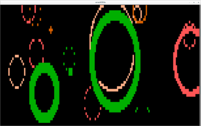

# cbeams

A command-line program which draws pretty animated colored circles in the
terminal.

> *I've seen things you people wouldn't believe. Attack ships on fire off the
> shoulder of Orion. I watched c-beams glitter in the dark, near the
> Tannhäuser Gate. All those moments will be lost, in time, like tears in
> rain. Time to die.*

Click the screenshot for an asciicast showing it in motion (Thanks asciinema!)

It genuinely does look much better running in a terminal locally, where the animation
is smoother. You should download and run it!

## Installing

[As a snap](https://snapcraft.io/cbeams), for Linux users:

    snap install cbeams

For Python people (Does work on Linux/OSX, not on Windows. Might from WSL?)

    $ pip install --user cbeams
    $ cbeams

## Hacking on the source

Be aware:

Developed on on Ubuntu 14.04 - 20.04, likely works on other Linux.
Does work on OSX.
Does not work on Windows. Might on WSL though.

Runs on Python 3.4 to 3.8.
Probably also runs on other 3.x.
Does not run on 2.x.

Python dependencies are specified in setup.py.

## Usage

    Usage:
        cbeams [ --help | --version | --overwrite ]

    Options:
        -h --help       Show this text.
        -v --version    Print version number and exit.
        -o --overwrite  Overwrite terminal's visible screenful of content.

Pressing ctrl-C exits cbeams, flipping back to the regular terminal buffer, so
the animation doesn't overwrite any of your previous terminal contents.

For fun, there's also a '-o' arg, which overwrites the terminal text without
flipping buffers. So you can see the expanding circles slowly eat away at your
existing terminal text, but then when you ctrl-c, it's not possible to restore
the terminal. So one screenful of your terminal text is overwritten and lost.

## Thanks

To Erik Rose, for the fabulous Blessings package.
https://pypi.python.org/pypi/blessings

To GitHub user @anonymouse64, for contributing packaging as a Snap, out of the goodness of his heart!

## Why did I develop this?

The traditional way to do colors or animation in a terminal is to use the
venerable UNIX library 'curses', or its open source clone 'ncurses'. There are
many Python packages that expose ncurses for various uses. Anyone who has used
these knows that curses is a definite contender for one of the worst APIs in
existence. It systematically exposes callers to reams of the incidental
complexity of the underlying implementation, accumulated by supporting decades
of generations of different terminals and terminal emulators.

Fortunately, nowadays there is a better way. Erik Rose's 'Blessings' package
layers a sane API on top of ncurses. The documentation page shows how 21 lines
of incomprehensible code using curses is transformed into four straightforward
lines of code using blessings.

I wanted an excuse to learn how blessings works, and cbeams is the result.

I tag it onto the end of long-running commands to use as a visual notification
that the command has finished.

## How it works

Aside from the use of Blessings, the other fun part of this project was in
representing the circles.

Obviously the model represents circles as a center point, radius, and a color.
To display these, we convert it into a representation that's useful for
outputting to the terminal. Namely, each circle is converted into a sequence of
horizontal slices. Each slice has a vertical position, a leftmost start
position, and a rightmost end position. To display this to the terminal, we
just print a line of colored space characters for each slice. Care was taken to
ensure that the resulting printed shape ended up symmetrical about both the
vertical and horizontal axes.

Interestingly, this representation as a series of horizontal slices lends
itself to representing other arbitrary shapes as well as just circles.

With this in mind, obviously the animation doesn't actually display just
circles. They are annuli or rings. So each ring is modelled as two circles, an
outer with a color, and an inner with a lesser radius.

To display a ring, we don't just draw the outer circle then overwrite it by
drawing the inner circle in black. This would display an annoying flicker
(there's no double-buffer or vsync), and would also prevent us from being able
to see through the holes in each ring. Instead, we perform the spatial
subtraction of 'outer_circle - inner_circle' to construct a new shape - the
ring as a series of horizontal slices.

It was tempting to write an arbitrary spatial operator to do this, capable of
subtracting any arbitrary shape from another shape, each represented as a
series of slices, resulting in a new series of slices. As satisfying as this
might have been it's clearly out of scope for this project, and as such,
test-driven development instead correctly steered me towards a simpler
function, that used its knowledge of what the input shapes are to produce the
required output in fewer lines of code.

Given this, drawing an annulus can use the exact same routine that we
previously described to draw a circle. Just iterate over the slices, printing
an appropriate length horizontal strip of colored spaces for each.

In each successive frame then, we asymptotically increase the inner and outer
radii of each annulus towards the annulus' predetermined 'max radius'. When the
inner radius gets close enough to that value, we remove that annulus from the
world.

There's an extra layer of complexity though. What we've described above would
work great if there was a double-buffering mechanism, whereby each frame erased
the whole back buffer, draw the next frame in its entirety there, and then
flipped buffers. This mechanism doesn't exist though. Hence, drawing
consecutive frames as described above doesn't erase the color from a character
square once an annulus' inner-radius passes over it.

To achieve that, instead of drawing the desired appearance of the current
frame, we instead draw the delta between the current frame and the last one.
Hence, we draw a thin colored annulus outside the outer radius, and a think
black annulus inside the inner radius.

The width of these thin "delta" annuli are just the difference between the
current radius value and the last frame. Hence, they are usually less than one
character wide, taking the form of just a series of disconnected dots speckling
the outer and inner edges of each visible circle. Over successive frames, the
colored dots slowly expand the outer radius, while the black ones eat away at
the inside radius, growing the black hole there.

Drawing the tiny deltas between successive frames like this prevents
overlapping circles from flickering badly as they would if we continually
overdrew each whole annulus on every frame.

Also, it ends up making the program run faster, and hence the animation
look pleasantly smoother, because we have far fewer characters to draw to
the terminal each frame.

We also have a random probability of adding new annuli into the world at each
frame. This probability varies sinusoidally over time, so that there are
quieter and noisier moments in the animation.

New annuli are assigned a randomly chosen color from a set of currently allowed
colors. We add and remove colors from that set over time, so that sometimes all
our rings are the same colors, sometimes two colors, and sometimes many colors.
This helps to keep the animation evolving over time, instead of looking too
'samey' all the time. 

## Hacking

To populate a virtualenv, run tests, etc, see the commands in the Makefile.
These can often work in Windows too, under Bash shells like Cygwin, Msys.

Populating the virtualenv in the manner shown in the Makefile will also
add "-e ." to the virtualenv, which adds this project in 'develop mode',
meaning both that source edits are immediately visible within the virtualenv,
and that the application entry points listed in setup.py are converted into
executable scripts on the PATH.

## Links & Contact

Python package: http://pypi.python.org/pypi/cbeams/

Binaries, source, issues: https://github.com/tartley/cbeams/

Author: Jonathan Hartley, email: tartley at domain tartley.com, Twitter: @tartley.

